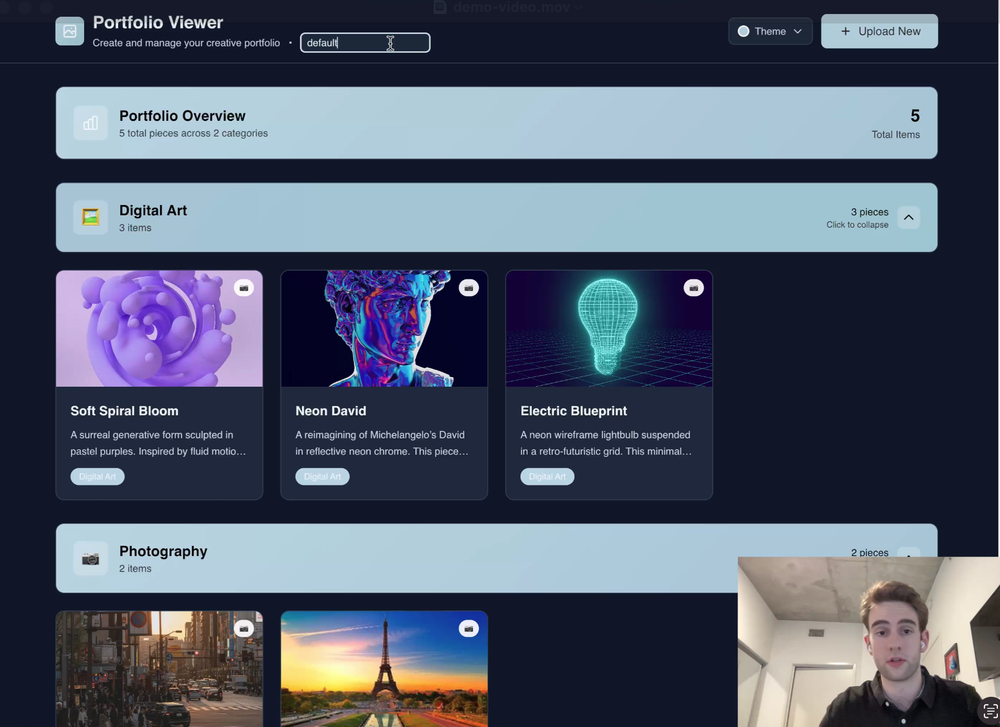
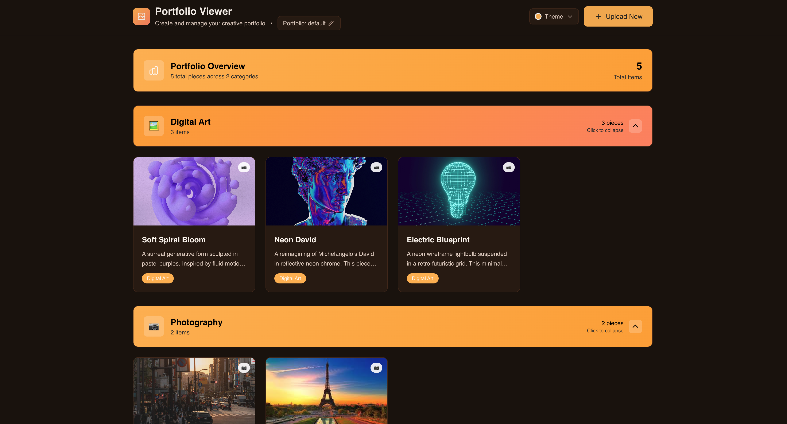
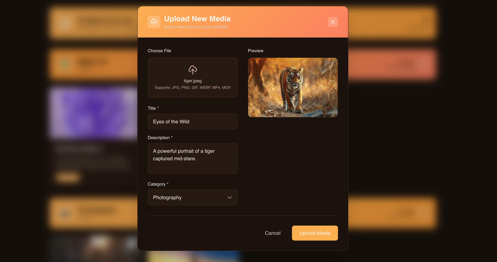

# Portfolio Manager

A full-stack portfolio viewer that lets users create and manage portfolios.

> Built for the Cashmere Full Stack Take-Home. 

This is a **single-page application (SPA)** built with **Next.js, Tailwind CSS, and FastAPI** that supports:
- Uploading images and videos
- Categorizing and previewing media
- Saving and reloading portfolios via a real MongoDB database
- Switching between multiple different portfolios
- Supports multiple theme colors and light/dark mode
- Polished and responsive UI with smooth animations

## [Live Deployment](https://portfolio-manager-takehome.vercel.app)

## Demo Video
<p align="center">
  <a href="https://youtu.be/lnqYRl4BoIw">
    
  </a>
</p>

## Images

<p align="center">
  
  
</p>


## Tech Stack
- **Frontend:** Next.js 15 (App Router), React, Tailwind CSS v4
- **State Management:** React Context
- **Animation:** Framer Motion
- **Backend:** FastAPI + Motor (MongoDB)
- **Storage:** Local file storage in dev, MongoDB Atlas in prod
- **Testing:** Playwright (frontend only)

## Testing

- `tests/` directory in the frontend
- Includes: homepage loading, modal interaction, form filling, file upload
- Run them with `npm test`

## Deployment
- Frontend is deployed with Vercel
- For the backend I used [Railway](https://railway.com/)
- MongoDB Atlas for the database

## Getting Started

#### 1. Clone the repo
```bash
git clone https://github.com/landerson02/fullstack-take-home.git
```

#### 2. Frontend
```bash
cd frontend/
npm run dev
```

#### 3. Backend
```bash
pip install -r requirements.txt
python main.py
```

## Future Improvements

If I had an extra day I would've:
- Implemented responsive design across all types of devices
- Users + accounts so multiple users can share their portfolios
- Allow users to create their own themes
- Use Amazon S3 for image storage (currently just stores directly on the backend)
